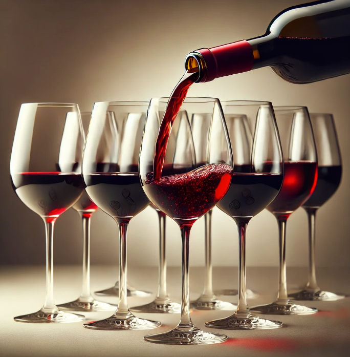

# Red_wine_quality_analysis

To classify the quality of wine, multiple features will be analyzed using regression and classification techniques to identify the most effective algorithm.

Link to the dataset: https://www.kaggle.com/datasets/uciml/red-wine-quality-cortez-et-al-2009

Volatile Acidity: Refers to the gaseous acids in wine, influencing its aroma and taste.

Fixed Acidity: Comprises primary acids like tartaric, succinic, citric, and malic, essential for the wine's structure.

Residual Sugar: The remaining sugar after fermentation, contributing to the wine's sweetness.

Citric Acid: A weak organic acid naturally found in citrus fruits, adding freshness to the wine.

Chlorides: Indicates the salt content in the wine, affecting its flavor.

Free Sulfur Dioxide: SO₂ is used to prevent oxidation and microbial spoilage in wine.

Total Sulfur Dioxide: The total amount of SO₂ present, crucial for preservation.

pH: Measures the acidity level, impacting the wine's balance and stability.

Density: Reflects the wine's sugar content and alcohol level.

Sulphates: Added to preserve freshness and protect the wine from oxidation and bacteria.

Alcohol: The percentage of alcohol, influencing the wine's body and warmth.

The data was cleaned, preprocessed, and visualized before implementing various algorithms:

Logistic Regression (Accuracy: 60%): A method used to model binary outcomes by estimating probabilities.

Decision Tree Classifier (Accuracy: 80%): A model that splits the data into branches to make decisions based on feature values.

Random Forest Classifier (Accuracy: 86%): An ensemble method that uses multiple decision trees to improve accuracy and prevent overfitting.

SVM Classifier (Accuracy: 63%): A method that finds the optimal boundary between classes by maximizing the margin.

K-Nearest Neighbors (Accuracy: 77%): A non-parametric method that classifies based on the closest training examples in the feature space.

Naive Bayes (Accuracy: 46%): A probabilistic classifier based on Bayes' theorem with strong independence assumptions.

Gradient Boosting Algorithm (Accuracy: 79%): An ensemble technique that builds models sequentially, each correcting the errors of the previous one.

Based on the analysis, the Random Forest Classifier emerged as the most effective model for classifying wine quality.
